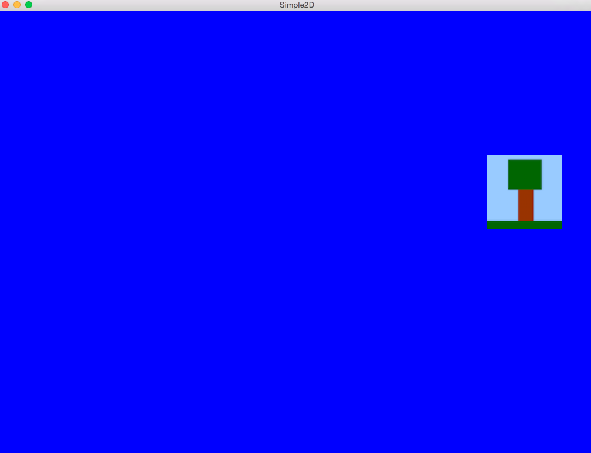

# SmilingLab

Inside this repository I'll store all the little projects I create to check out new features, technologies
or simply some new ideas. Often I just want to find out whether an idea or something is actually working. 
Without having the need to create an absolutely perfect code at the end, I can test stuff really quickly this way.
So, please be aware that the source code will not be really nice or effective or reliable (at least not always ;)).

## PerPixelLigthing

This project is a simple demo to demonstrate PerPixelLighting using GLSL.

## Simple2D

It's a basic project to see how to use the SFML framework by implementing a simple 2D scene where an image
is bouncing from one edge of the window to another. 

