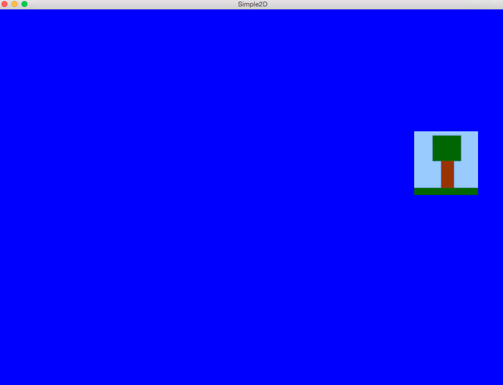

# Simple2D - 2D Graphic Test

This is a simple project to check out the 2D capabilities of the SFML framework.
So, this application is based on the official SFML framework tutorial, you can find it
here: http://www.sfml-dev.org/tutorials/2.3/graphics-draw.php

I'll play with it a little bit around but the most part of it will be from that tutorial.